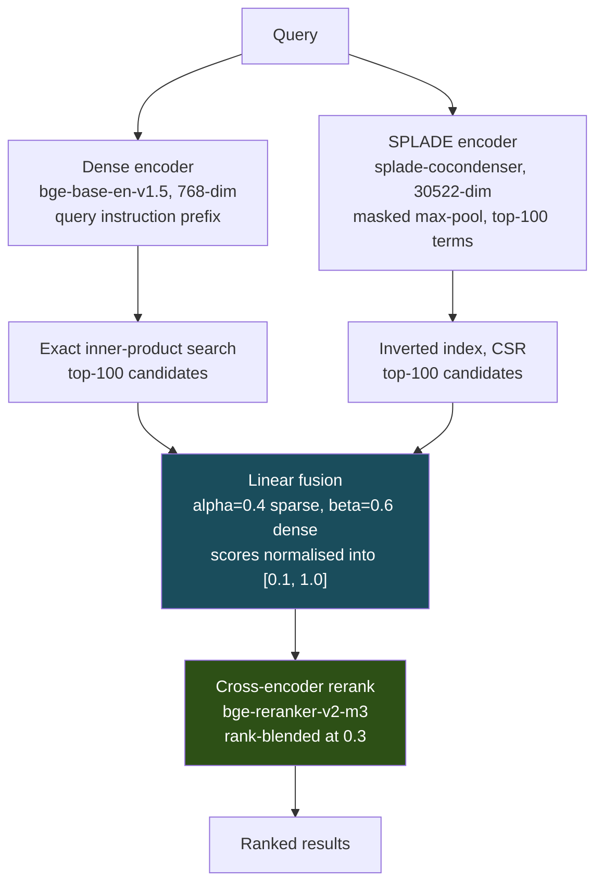
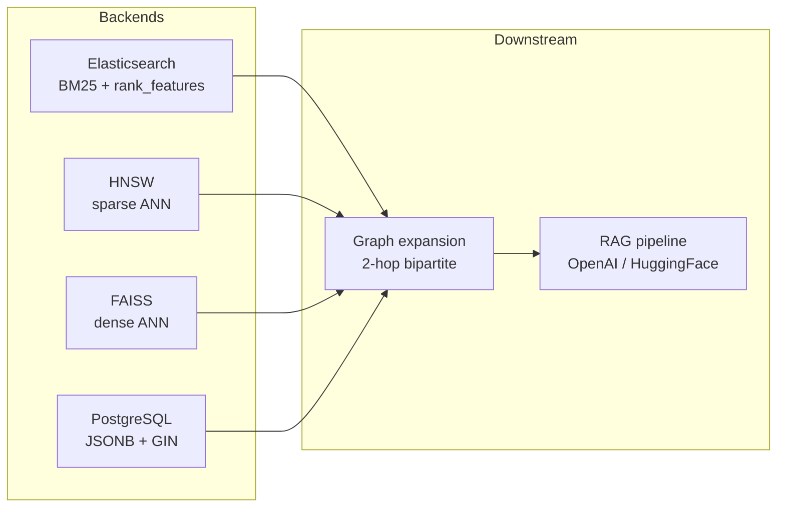

# Bone Engine

A research-grade hybrid retrieval system: learned sparse retrieval (SPLADE),
dense bi-encoder search, score-space fusion, and cross-encoder reranking,
benchmarked end-to-end on BEIR.

**0.6101 average nDCG@10** on the BEIR laptop subset (SciFact, NFCorpus, FiQA,
TREC-COVID), against 0.4705 for a BM25 baseline and 0.5758 for the stock dense
model the system is built on. Runs entirely within 6 GB of VRAM.

---

## Table of contents

- [The problem](#the-problem)
- [Theoretical background](#theoretical-background)
- [Results](#results)
- [Architecture](#architecture)
- [Quick start](#quick-start)
- [Scope: what is and is not measured](#scope-what-is-and-is-not-measured)
- [Configuration](#configuration)
- [GPU support](#gpu-support)
- [Design decisions](#design-decisions)
- [Correctness fixes](#correctness-fixes)
- [Project structure](#project-structure)
- [Testing](#testing)

---

## The problem

Retrieval systems fail in two characteristic ways, and the failures are
complementary.

**Lexical mismatch.** A term-matching system scores a document by the query
terms it contains. If a user asks about "heart attack" and the document says
"myocardial infarction", the intersection is empty and the document scores
zero, regardless of how relevant it is. This is the *vocabulary mismatch
problem*, and it is the fundamental limitation of exact term matching.

**Semantic drift.** A dense embedding system maps text into a continuous vector
space where proximity approximates relatedness. This solves vocabulary mismatch
but introduces the opposite failure: rare, precise tokens — a product SKU, a
gene name, a specific numeric threshold — get smeared into a region of the
space shared with everything topically adjacent. Exact identifiers are exactly
what embeddings compress away.

Neither approach dominates. On the four datasets benchmarked here, sparse
retrieval wins on no dataset outright, but it retrieves documents dense misses
often enough that fusing the two beats either alone on all four. That
complementarity is the entire justification for a hybrid architecture: not that
two rankers are better than one, but that these two fail on *different*
documents.

---

## Theoretical background

### Sparse lexical retrieval

Classical retrieval represents a document as a sparse vector over the
vocabulary, weighting each term by how often it appears locally against how
rare it is globally. BM25 is the standard instance:

```
score(q, d) = Σ_{t ∈ q}  IDF(t) · ( f(t,d) · (k₁ + 1) )
                         ------------------------------------------
                         f(t,d) + k₁ · (1 - b + b · |d| / avgdl)
```

The term frequency `f(t,d)` saturates — the tenth occurrence of a word adds far
less than the second — and `IDF(t)` upweights terms that discriminate between
documents. It is unsupervised, fast, and remains a hard baseline: BM25 still
beats many neural systems on out-of-domain data.

Its weakness is that the vector is fixed to the terms literally present. There
is no mechanism for a document to match a query term it does not contain.

### Learned sparse retrieval (SPLADE)

SPLADE keeps the sparse, invertible-index-friendly representation but *learns*
the weights, including weights for terms the document never contained. It reuses
a masked-language-model head: for input token position `i`, the MLM produces a
logit `w_ij` over every vocabulary term `j`. The document's weight for term `j`
is a max-pool over positions of a log-saturated ReLU:

```
w_j = max_{i ∈ tokens}  log( 1 + ReLU(w_ij) )
```

Three properties follow, and each matters:

1. **Term expansion.** A document about "myocardial infarction" receives nonzero
   weight on "heart" because the MLM predicts it as plausible at those
   positions. Vocabulary mismatch is attacked directly, in the sparse space.
2. **Log saturation** mirrors BM25's diminishing returns, preventing a single
   high-confidence token from dominating the representation.
3. **Max pooling** means one strongly-predictive position suffices; a term does
   not need to be predicted everywhere.

The result stays sparse enough for an inverted index (this repo keeps the top
100 terms per document) while carrying learned semantics. Two implementation
details are easy to get wrong and both were bugs here: the pooling **must** be
masked so padding positions cannot contribute terms, and the vocabulary index
must be preserved exactly — round-tripping a token through `decode()` and
`encode()` silently relocates subword tokens to different dimensions.

### Dense bi-encoders

A bi-encoder maps query and document *independently* into a shared space and
scores by inner product on L2-normalised vectors, which is cosine similarity:

```
s(q, d) = ⟨ E(q), E(d) ⟩ ,   ‖E(·)‖₂ = 1
```

Independence is the entire point: documents can be encoded once, offline, and
searched with an ANN index in sublinear time. It is also the fundamental
limitation — the document vector is computed *before the query is known*, so it
must be a lossy summary adequate for every possible query. Fine-grained
query-document interaction is unavailable by construction.

Retrieval is also **asymmetric**. A short interrogative query and a long
declarative passage are not interchangeable inputs, and models in the BGE, E5,
and GTE families are trained with an instruction prefix on the query side only.
Omitting it costs roughly 1-3 nDCG@10 for BGE. This system applies the prefix in
`encode_query` and never in `encode`.

### Why fusion works, and how it can fail

Given ranked lists from independent retrievers, there are two ways to combine
them, and the choice is not cosmetic.

**Rank-space fusion (RRF)** discards scores entirely and combines reciprocal
ranks:

```
RRF(d) = Σ_i  w_i / (k + rank_i(d))
```

This is robust precisely because it is scale-free — BM25 sums, SPLADE dot
products, and cosine similarities live on incomparable scales, and RRF never
compares them. The constant `k` (conventionally 60) damps the influence of the
very top ranks, so that a single retriever's first-place pick cannot
automatically win. The cost is that *confidence is discarded*: a retriever that
is certain about rank 1 and a retriever that is nearly indifferent between
ranks 1 and 2 contribute identically.

**Score-space fusion (linear)** preserves confidence by normalising each list
and taking a weighted sum:

```
s(d) = α · norm(s_sparse(d)) + β · norm(s_dense(d))
```

This retains the *margin* between candidates, which is real information, but
becomes hostage to the normaliser. Min-max normalisation in particular is
dangerous in two ways:

1. It **amplifies compressed ranges**. BM25 scores of 9.0, 8.5, 8.0 are nearly
   tied, but min-max stretches them across the full unit interval, manufacturing
   confidence that the retriever never expressed.
2. It **conflates absence with worst-place** if the range maps to `[0, 1]`. The
   lowest-ranked retrieved document receives exactly 0.0 — indistinguishable
   from a document the retriever never returned at all. A document ranked #1 by
   dense and last by sparse then scores identically to one ranked #1 by sparse
   and never seen by dense.

The second is a genuine defect rather than a tuning preference, and it caused
fused rankings here to score *below their own best input*. The fix is to map
retrieved documents into `[ε, 1]` with `ε > 0`, so that "ranked last" strictly
outranks "not retrieved". With that correction, linear fusion measurably beats
RRF on this benchmark (0.5701 vs 0.5633) because the preserved margins carry
signal. RRF remains the safer default when score distributions are unknown or
unbounded.

### The retrieve-then-rerank cascade

A **cross-encoder** scores a pair jointly, letting every query token attend to
every document token:

```
s(q, d) = f( [CLS] q [SEP] d [SEP] )
```

This recovers exactly the interaction the bi-encoder threw away, and it is
substantially more accurate. It is also unusable as a retriever: scoring a
query against `N` documents requires `N` forward passes, so cost is linear in
corpus size rather than sublinear. For 171,332 documents that is prohibitive.

The standard resolution is a cascade. A cheap first stage retrieves a shortlist
of `k` candidates; the expensive model reranks only those. Cost becomes linear
in `k`, not in corpus size. The tradeoff this introduces is a **recall
ceiling**: the reranker can only reorder what the first stage retrieved, so any
relevant document outside the top-`k` is permanently lost. Shortlist depth
therefore trades latency against the achievable maximum, and the first stage's
recall@k — not its nDCG — is the quantity that matters for it.

A subtlety that is usually left unstated: a cross-encoder is trained on a
particular notion of relevance, generally question-to-passage. When queries have
a different shape — a claim to be verified, a bare keyword, a title — the model
is being asked to score a relation it was not trained on, and it can confidently
rank a topically-related non-answer above the correct document. Granting it
unconditional authority over the ranking is then actively harmful. Treating its
output as *evidence to be fused* rather than a *replacement ranking* bounds that
damage; see [design decision 3](#design-decisions) for the measured effect,
which is large in both directions.

### Evaluation

The headline metric is **nDCG@10**, the standard for BEIR. Discounted cumulative
gain rewards placing highly-relevant documents early, with a logarithmic
positional discount:

```
DCG@k = Σ_{i=1}^{k}  (2^{rel_i} - 1) / log₂(i + 1)
nDCG@k = DCG@k / IDCG@k
```

The exponential gain `2^rel - 1` means graded relevance is not treated
linearly: a highly relevant document is worth disproportionately more than a
marginally relevant one. Normalising by the ideal ordering (IDCG) makes scores
comparable across queries with different numbers of relevant documents. The
cutoff at 10 reflects that users rarely look further.

Scoring uses `pytrec_eval`, the Python binding to the official `trec_eval` C
implementation, rather than a reimplementation. Published BEIR numbers are
produced by `trec_eval`, and small divergences in tie-handling or graded-gain
conventions would silently make local numbers non-comparable.

**Zero-shot generalisation** is what BEIR is designed to measure. Its datasets
span domains (biomedical, financial, scientific claims) and query shapes with
no in-domain training data, which is why a model fine-tuned on one corpus
frequently loses to a well-chosen pretrained model evaluated zero-shot. That
finding drove this project's central decision not to train anything.

---

## Results

nDCG@10, full corpora, no truncation. Measured on an RTX 4050 Laptop (6 GB)
with `bge-base-en-v1.5` + SPLADE + `bge-reranker-v2-m3`, linear fusion at
alpha=0.4, `blend_weight=0.3`. Raw output in `results/beir_results.json`.

| Stage | SciFact | NFCorpus | FiQA | TREC-COVID | Avg |
|---|---|---|---|---|---|
| sparse (SPLADE) | 0.6862 | 0.3415 | 0.3417 | 0.7174 | 0.5217 |
| dense (BGE) | 0.7417 | 0.3736 | 0.4063 | 0.7814 | 0.5758 |
| hybrid | 0.7587 | 0.3816 | 0.4191 | 0.8190 | 0.5946 |
| **hybrid + rerank** | **0.7628** | **0.3838** | **0.4382** | **0.8556** | **0.6101** |

237,786 documents, 1,321 queries, 76 minutes end-to-end.

### The dense row is a control, not a result

The dense stage runs a stock model with no local tuning, so it should reproduce
published figures. It does, on all four datasets:

| | measured | published (bge-base-en-v1.5) |
|---|---|---|
| SciFact | 0.7417 | 0.741 |
| NFCorpus | 0.3736 | 0.373 |
| FiQA | 0.4063 | 0.406 |
| TREC-COVID | 0.7814 | 0.781 |

This is the most important number in the repository. Agreement across four
datasets with different domains and query shapes is strong evidence that
encoding, retrieval, and scoring are all correct — without it, the headline
average would be an unfalsifiable number the code happened to print. **If a
change moves the dense row off these values, something broke.** It is a canary,
not a target to optimise.

### Stage contributions

Fusion adds 1.9 nDCG@10 over dense alone; reranking adds 1.6 more. The
reranker's contribution is strongly dataset-dependent, and the pattern follows
query shape exactly as the theory above predicts:

| Dataset | Query shape | Rerank gain |
|---|---|---|
| TREC-COVID | natural question | +3.7 |
| FiQA | natural question | +1.9 |
| SciFact | claim to verify | +0.4 |
| NFCorpus | keyword / title | +0.2 |

`blend_weight=0.3` was tuned on SciFact and NFCorpus only and still improved
both unseen datasets, so it generalises across query shapes. A corpus of purely
natural-language questions may support a higher weight; measure with
`scripts/tune_rerank_blend.py` rather than assuming.

### Positioning

This is a correct, validated, competitive system for its weight class (110M
dense encoder plus a 568M reranker, inside 6 GB). It is **not** absolute
state-of-the-art on BEIR — that belongs to 7B-parameter retrievers such as
E5-Mistral, which will not fit in this VRAM budget. Within the constraint, it is
close to what is achievable.

Caveats worth stating plainly:

- **Four of BEIR's eighteen datasets.** This average is not a full-BEIR score
  and should not be quoted as one.
- **Tuning was fit on two datasets** and held on two unseen ones. That is good
  evidence, not proof it transfers to an arbitrary corpus.
- **FiQA (0.4382) is the weakest relative showing.** Top systems reach ~0.47
  with larger rerankers; that is where the remaining headroom lies.

---

## Architecture

The benchmarked path is dense + sparse, fused, then reranked. Elasticsearch,
PostgreSQL, HNSW, graph expansion, and RAG exist as production backends and
baselines but are not on the measured path — see
[Scope](#scope-what-is-and-is-not-measured).



Optional components, not benchmarked:



---

## Quick start

### Prerequisites

- Python 3.10+
- A CUDA GPU is strongly recommended; CPU works but encoding is ~70x slower
- Docker Desktop, only for the Elasticsearch and PostgreSQL backends
- Visual C++ Build Tools, only for `hnswlib`

### Installation

```powershell
python -m venv venv
.\venv\Scripts\Activate.ps1

# Install CUDA PyTorch FIRST; pip will otherwise resolve a CPU-only build
pip install torch --index-url https://download.pytorch.org/whl/cu121

pip install -r requirements.txt
```

Verify the GPU is visible before any long run:

```powershell
python -c "import torch; print(torch.__version__, torch.cuda.is_available())"
```

### Run the benchmark

No infrastructure required; the benchmark path uses in-memory indexes and
datasets download to `data/beir/` on first use.

```powershell
# Fastest real benchmark: SciFact, 5,183 docs, a few minutes on GPU
python scripts/run_beir.py --datasets scifact

# Full laptop subset, ~76 minutes on a 4050
python scripts/run_beir.py --datasets scifact nfcorpus fiqa trec-covid
```

Variations:

```powershell
# Ablate the reranker to isolate its contribution
python scripts/run_beir.py --datasets scifact --no-rerank

# A/B a model without editing the config
python scripts/run_beir.py --datasets scifact --dense-model BAAI/bge-large-en-v1.5
python scripts/run_beir.py --datasets scifact --reranker-model BAAI/bge-reranker-base
python scripts/run_beir.py --datasets scifact --blend-weight 0.5

# Smoke test on a truncated corpus; scores are NOT comparable to published
python scripts/run_beir.py --datasets scifact --max-corpus 2000 --max-queries 20
```

### Tuning

Two settings are worth re-tuning per corpus. Both encode once and sweep over
cached results, so a full sweep costs about one benchmark run:

```powershell
python scripts/tune_rerank_blend.py   # reranker model and authority
python scripts/tune_fusion.py         # fusion weights and strategy
```

### Legacy pipeline (Elasticsearch / PostgreSQL)

Requires Docker infrastructure and operates on your own JSONL data:

```powershell
docker-compose up -d elasticsearch postgres

python scripts/index_documents.py   --config config.yaml --backend all
python scripts/build_sparse_hnsw.py --config config.yaml
python scripts/build_dense_faiss.py --config config.yaml
python scripts/run_queries.py       --config config.yaml
python scripts/evaluate.py          --config config.yaml
```

Substitute `config.docker.yaml` and run through `docker-compose run --rm engine`
for the containerised equivalent.

---

## Scope: what is and is not measured

A benchmark number invites the assumption that everything in the repository was
benchmarked. It was not.

| Component | Status |
|---|---|
| Dense retrieval (BGE) | Measured, validated against published figures |
| SPLADE sparse retrieval | Measured |
| Hybrid fusion | Measured and tuned |
| Cross-encoder reranking | Measured and tuned |
| Elasticsearch / PostgreSQL backends | Functional, not benchmarked |
| HNSW / FAISS ANN indexes | Functional, recall loss not quantified |
| Graph expansion | Disabled by default (`gamma: 0.0`); was not contributing |
| RAG pipeline | Functional, no answer-quality evaluation |

The benchmark path deliberately uses exact search and no external services. ANN
indexes trade recall for speed, which would confound retrieval quality with
index configuration; and requiring a running cluster to reproduce a number makes
that number harder to trust and harder to reproduce.

---

## Data format

For the legacy pipeline, place files in `data/`:

```json
// documents.jsonl
{"doc_id": "d1", "content": "Information retrieval is the process of..."}

// queries.jsonl
{"query_id": "q1", "text": "What is information retrieval?"}

// qrels.jsonl
{"query_id": "q1", "relevant_doc_ids": ["d1", "d5", "d12"]}
```

BEIR datasets use their own layout, handled by `src/data/beir_loader.py`. Note
that BEIR qrels are graded, and a grade of 0 means *explicitly judged
non-relevant* — it must not be treated as a positive. Queries without judgments
are excluded from scoring, since an unjudged query has an undefined score rather
than a zero one.

---

## Configuration

`config.yaml`:

| Key | Default | Description |
|---|---|---|
| `dense.model_name` | `BAAI/bge-base-en-v1.5` | Dense bi-encoder, 768-dim |
| `dense.max_length` | `512` | Token cap per document |
| `dense.fp16` | `true` | Half precision, CUDA only |
| `splade.model_name` | `naver/splade-cocondenser-ensembledistil` | Sparse encoder |
| `splade.top_k` | `100` | Sparse terms retained per document |
| `splade.quantize` | `false` | 8-bit weight quantization |
| `reranker.model_name` | `BAAI/bge-reranker-v2-m3` | Cross-encoder |
| `reranker.blend_weight` | `0.3` | Reranker authority; see [design decision 3](#design-decisions) |
| `fusion.strategy` | `linear` | `linear` or `rrf` |
| `fusion.alpha` / `beta` | `0.4` / `0.6` | Sparse / dense weight |
| `fusion.gamma` | `0.0` | Graph weight; 0 disables the branch |
| `benchmark.rerank_top_n` | `100` | Shortlist depth; trades latency against nDCG |
| `elasticsearch.host` | `http://localhost:9200` | Elasticsearch URL |
| `postgres.password` | `research_pass` | PostgreSQL password |

`config.docker.yaml` mirrors these with compose service names. Keep model and
fusion settings synchronised between the two: a mismatch makes container results
silently incomparable to local ones.

---

## GPU support

Encoding throughput dominates runtime. Check this before any long run — a
CPU-only PyTorch build installs silently and turns a 76-minute benchmark into a
multi-day one:

```powershell
python -c "import torch; print(torch.__version__, torch.cuda.is_available())"
# '2.x.y+cpu False'  -> GPU idle, reinstall below
# '2.x.y+cu121 True' -> good
```

```powershell
pip uninstall -y torch
pip install torch --index-url https://download.pytorch.org/whl/cu121
```

A virtualenv can shadow a working CUDA install present in the system
interpreter. Check the interpreter actually executing, not the one you assume.

### Measured throughput

RTX 4050 Laptop (6 GB) against CPU, `bge-base-en-v1.5` + SPLADE:

| Stage | CPU | GPU | Speedup |
|---|---|---|---|
| Dense encoding | 357 ms/doc | 3.8 ms/doc | 94x |
| SPLADE encoding | 330 ms/doc | 4.7 ms/doc | 70x |
| Cross-encoder rerank | 7,258 ms/query | ~1,900 ms/query | 3.8x |

The full subset takes 76 minutes on GPU; at CPU rates the encoding alone would
take roughly 45 hours.

Reranking dominates per-query cost. `bge-reranker-v2-m3` runs at ~1.9 s/query
over a 100-candidate shortlist against ~0.67 s/query for `bge-reranker-base`.
The two are statistically tied on SciFact and NFCorpus (0.0014 apart, trading
wins per dataset); `-v2-m3` earns its 3x cost mainly on question-shaped corpora
(+3.7 on TREC-COVID). **If latency matters, use `-base`.**

VRAM sits at roughly 5.7 GB of 6.1 GB during a full run. On OOM, lower
`reranker.batch_size` first, then `benchmark.rerank_top_n`.

| Operation | CPU | GPU |
|---|---|---|
| SPLADE and dense encoding | yes | yes, much faster |
| Cross-encoder reranking | yes | yes, much faster |
| FAISS search | yes | yes, with faiss-gpu |
| HNSW, graph, Elasticsearch, PostgreSQL | yes | CPU or server only |

---

## Design decisions

Ordered by effect on the score, and by how likely each is to be "corrected"
back into a bug by someone reading the code fresh.

1. **Retrieved documents normalise into `[0.1, 1.0]`, not `[0.0, 1.0]`.** A
   document a retriever ranked last must still outrank one it never returned.
   Mapping the worst document to exactly 0.0 makes those cases identical, which
   is what made linear fusion score below every one of its own inputs. See
   [why fusion works](#why-fusion-works-and-how-it-can-fail).

2. **Linear fusion is the default at alpha=0.4 sparse, beta=0.6 dense.**
   Measured, not assumed. With normalisation corrected, linear preserves the
   margin between candidates, which RRF discards by construction. Averaged over
   SciFact and NFCorpus: `linear alpha=0.4` gives 0.5701, `rrf alpha=0.2` gives
   0.5633, `rrf alpha=0.4` gives 0.5555, dense alone gives 0.5577. RRF remains
   safer when score distributions are uncalibrated or unbounded.

3. **The reranker is blended, not authoritative (`blend_weight=0.3`).** The
   least obvious setting here and the most consequential. Cross-encoders are
   trained on question-to-passage relevance, so on claim-style queries
   (SciFact: *"1/2000 in UK have abnormal PrP positivity"*) they rank
   topically-related non-gold documents above gold ones. Letting one overwrite a
   strong first-stage ranking costs 5.3 nDCG@10; blending at 0.3 gains 1.6:

   | blend_weight | SciFact nDCG@10 |
   |---|---|
   | 0.0 (reranker ignored) | 0.7446 |
   | 0.3 (default) | 0.7604 |
   | 1.0 (reranker overwrites) | 0.6913 |

   Both rerankers peak at 0.2-0.3 and degrade monotonically above it.
   Implemented as weighted RRF over the first-stage and reranked orderings, so
   the reranker contributes rank evidence rather than replacing the ranking.

4. **Asymmetric query encoding.** BGE, E5, and GTE are trained with an
   instruction prefix on the query side only; omitting it costs 1-3 nDCG@10 for
   BGE. Applied in `encode_query`, never in `encode`.

5. **Cross-encoder reranking over a top-100 shortlist.** Recovers the
   query-document interaction the bi-encoder discards, at cost linear in
   shortlist depth rather than corpus size. Depth sets the recall ceiling.

6. **Exact search on the benchmark path.** ANN trades recall for speed, which
   would confound retrieval quality with index tuning. Measured separately.

7. **SPLADE top-K = 100.** Over 95% of discriminative signal sits in the top 100
   terms; retaining more inflates the index for negligible gain.

8. **8-bit quantization**, `weight_q = int((w / global_max) * 255)`, roughly 4x
   compression for under 1% recall loss.

9. **HNSW over 30522-dim sparse vectors** deliberately demonstrates the memory
   and latency cost of sparse ANN against a proper inverted index.

10. **Graph 2-hop decay = 0.5** halves each hop's contribution so distant
    neighbours cannot dominate. Currently disabled (`gamma: 0.0`).

11. **PostgreSQL as a baseline** shows a standard RDBMS performs reasonable
    sparse retrieval without a dedicated engine.

---

## Correctness fixes

Four defects were found and fixed while building the benchmark. Each degraded
retrieval quality silently, and each is now pinned by regression tests.

| Defect | Effect | Location |
|---|---|---|
| Fusion normalisation collapsed the worst-ranked document to 0.0, making "ranked last" identical to "never retrieved" | Hybrid fusion scored below its own best component (0.640 against 0.933 nDCG@10 on the previous toy data) | `src/fusion/hybrid_fusion.py` |
| SPLADE max-pooled without the attention mask | Padding positions leaked vocabulary terms into short documents batched alongside long ones | `src/encoder/splade_encoder.py` |
| SPLADE keyed vectors by decoded token strings, re-encoded via `tokenizer.encode(...)[0]` | Lossy for subwords: `decode` strips the `##` continuation marker, so `##ing` relocated to a different dimension | `src/encoder/splade_encoder.py` |
| HNSW dimension fallback used `hash(token) % 30522` | Python randomises string hashes per process, so an index built in one run was queried against different dimensions in the next | `src/backends/hnsw_backend.py` |

Earlier versions of this README reported Recall@10 = 1.000 on a 15-document
corpus with 5 queries. Retrieving 10 documents from a 15-document collection
returns two-thirds of the corpus, so those figures measured corpus size rather
than retrieval quality. They have been replaced by the BEIR results above.

---

## Project structure

```
Bone Engine/
├── config.yaml / config.docker.yaml
├── requirements.txt
├── Dockerfile / Dockerfile.gpu
├── docker-compose.yml / docker-compose.gpu.yml
│
├── src/
│   ├── encoder/
│   │   ├── dense_encoder.py      # BGE, asymmetric query prefixes
│   │   └── splade_encoder.py     # SPLADE, masked pooling, token-ID keys
│   ├── rerank/
│   │   └── cross_encoder.py      # Cross-encoder and rank blending
│   ├── pipeline/
│   │   └── retrieval_pipeline.py # Dense + sparse, fusion, rerank
│   ├── fusion/
│   │   └── hybrid_fusion.py      # Linear and weighted RRF
│   ├── data/
│   │   └── beir_loader.py        # BEIR download and parsing
│   ├── evaluation/
│   │   ├── beir_eval.py          # Official trec_eval scoring
│   │   └── metrics.py            # Recall, nDCG, MRR
│   ├── backends/                 # Elasticsearch, HNSW, FAISS, PostgreSQL
│   ├── graph/                    # 2-hop bipartite expansion
│   └── rag/                      # Retrieval to LLM
│
├── scripts/
│   ├── run_beir.py               # Primary entry point
│   ├── tune_rerank_blend.py      # Reranker model and authority sweep
│   ├── tune_fusion.py            # Fusion weight and strategy sweep
│   ├── index_documents.py        # Legacy pipeline
│   ├── build_sparse_hnsw.py
│   ├── build_dense_faiss.py
│   ├── run_queries.py
│   ├── evaluate.py
│   └── benchmark_gpu_vs_cpu.py
│
├── tests/                        # 89 tests
├── data/                         # Input JSONL, BEIR cache, indexes
└── results/                      # beir_results.json, *_sweep.json
```

---

## Testing

```powershell
pytest                  # full suite, 89 tests
pytest -m "not slow"    # skip tests that download models
```

Coverage includes fusion semantics (with an explicit regression for the
normalisation defect), IR metrics against hand-computed values, BEIR scoring,
SPLADE token mapping, HNSW dimension stability across processes, reranker
blending, and pipeline stage wiring. Tests requiring `hnswlib` skip cleanly when
it is absent.

---

## Elasticsearch index mapping

```json
{
  "mappings": {
    "properties": {
      "doc_id":       { "type": "keyword" },
      "content":      { "type": "text", "analyzer": "standard" },
      "splade_terms": { "type": "rank_features" },
      "metadata":     { "type": "object", "enabled": false }
    }
  }
}
```

`rank_features` stores SPLADE term weights so Elasticsearch can score learned
sparse representations directly, combining them with a standard BM25 clause over
the analysed text.

---

## References

- Robertson & Zaragoza, *The Probabilistic Relevance Framework: BM25 and Beyond* (2009)
- Formal et al., *SPLADE: Sparse Lexical and Expansion Model for First Stage Ranking* (2021)
- Cormack et al., *Reciprocal Rank Fusion Outperforms Condorcet and Individual Rank Learning Methods* (2009)
- Nogueira & Cho, *Passage Re-ranking with BERT* (2019)
- Thakur et al., *BEIR: A Heterogeneous Benchmark for Zero-shot Evaluation of Information Retrieval Models* (2021)
- Järvelin & Kekäläinen, *Cumulated Gain-based Evaluation of IR Techniques* (2002)

---

## License

Research use only. See individual model licenses:
[`naver/splade-cocondenser-ensembledistil`](https://huggingface.co/naver/splade-cocondenser-ensembledistil),
[`BAAI/bge-base-en-v1.5`](https://huggingface.co/BAAI/bge-base-en-v1.5),
[`BAAI/bge-reranker-v2-m3`](https://huggingface.co/BAAI/bge-reranker-v2-m3).
BEIR datasets carry their own per-dataset licenses.
