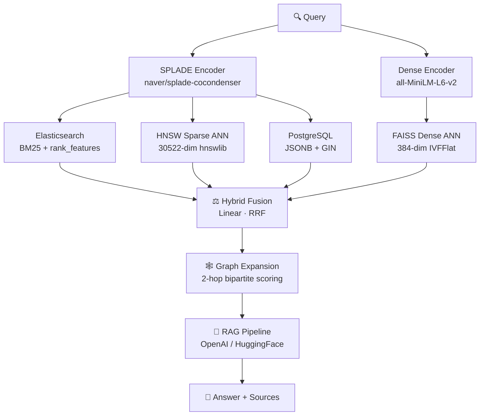
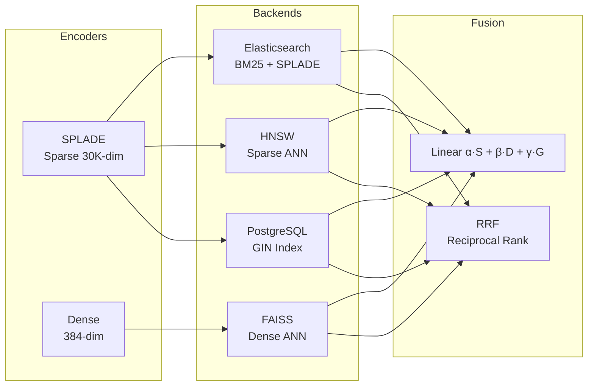
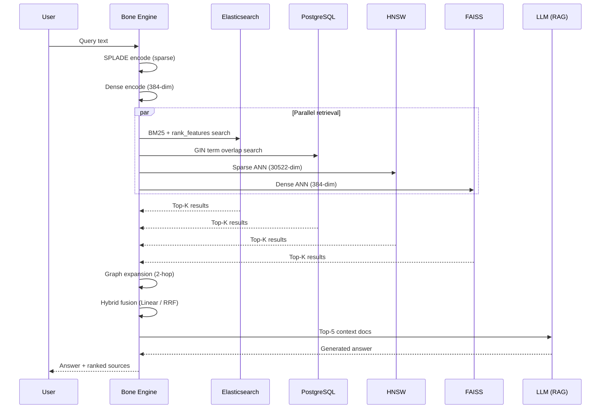
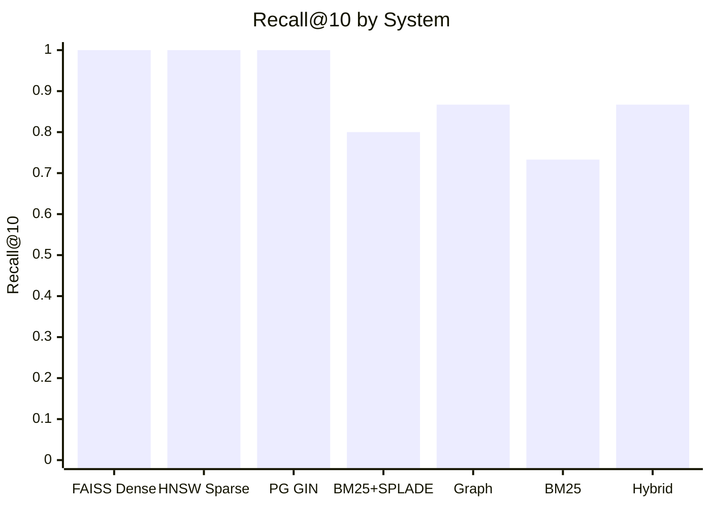
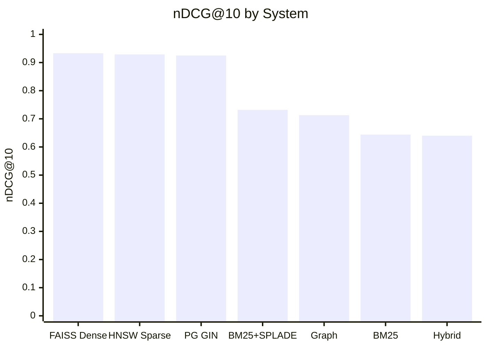

# 🦴 Bone Engine

> **A research grade hybrid semantic search system**  combining sparse SPLADE retrieval, dense vector search, graph expansion, and RAG generation into a unified, benchmarkable pipeline.

---

## Architecture



---

## System Components



---

## Data Flow



---

## Quick Start (Local)

### Prerequisites
- Python 3.10+
- Docker Desktop (for Elasticsearch + PostgreSQL)
- Visual C++ Build Tools (for `hnswlib`)
- (Optional) CUDA GPU for faster encoding

### Installation

```powershell
# Clone and setup
python -m venv venv
.\venv\Scripts\Activate.ps1

# Install PyTorch (CPU)
pip install torch --index-url https://download.pytorch.org/whl/cpu

# Install all dependencies
pip install -r requirements.txt
```

### Start Infrastructure

```powershell
docker-compose up -d elasticsearch postgres
# Wait ~30s for healthy status
docker-compose ps
```

### Run the Full Pipeline

```powershell
# Step 1 — Encode + index documents
python scripts/index_documents.py --config config.yaml --backend all

# Step 2 — Build HNSW sparse ANN index
python scripts/build_sparse_hnsw.py --config config.yaml

# Step 3 — Build FAISS dense ANN index
python scripts/build_dense_faiss.py --config config.yaml

# Step 4 — Run all queries
python scripts/run_queries.py --config config.yaml

# Step 5 — Evaluate (Recall@K, nDCG@K, MRR)
python scripts/evaluate.py --config config.yaml

# Step 6 — GPU vs CPU benchmark
python scripts/benchmark_gpu_vs_cpu.py --config config.yaml
```

### Ad-hoc Query

```powershell
python scripts/run_queries.py --config config.yaml --query "what is information retrieval?"
```

---

## Quick Start (Docker)

```powershell
# Start infrastructure
docker-compose up -d elasticsearch postgres

# Build + run the full experiment pipeline
docker-compose build engine
docker-compose run --rm engine python scripts/index_documents.py  --config config.docker.yaml
docker-compose run --rm engine python scripts/build_sparse_hnsw.py --config config.docker.yaml
docker-compose run --rm engine python scripts/build_dense_faiss.py --config config.docker.yaml
docker-compose run --rm engine python scripts/run_queries.py       --config config.docker.yaml
docker-compose run --rm engine python scripts/evaluate.py          --config config.docker.yaml
```

---

## Data Format

Place files in `data/`:

**Documents** (`data/documents.jsonl`):
```json
{"doc_id": "d1", "content": "Information retrieval is the process of..."}
```

**Queries** (`data/queries.jsonl`):
```json
{"query_id": "q1", "text": "What is information retrieval?"}
```

**Relevance Judgments** (`data/qrels.jsonl`):
```json
{"query_id": "q1", "relevant_doc_ids": ["d1", "d5", "d12"]}
```

---

## Configuration (`config.yaml`)

| Key | Default | Description |
|-----|---------|-------------|
| `splade.device` | `"auto"` | `"auto"` / `"cpu"` / `"cuda"` |
| `splade.top_k` | `100` | Sparse terms per document |
| `splade.quantize` | `false` | 8-bit weight quantization |
| `dense.model_name` | `all-MiniLM-L6-v2` | Sentence-transformer model |
| `fusion.strategy` | `"linear"` | `"linear"` or `"rrf"` |
| `fusion.alpha/beta/gamma` | `0.4/0.4/0.2` | Sparse / Dense / Graph weights |
| `rag.llm_backend` | `"openai"` | `"openai"` or `"huggingface"` |
| `elasticsearch.host` | `localhost:9200` | ES URL |
| `postgres.password` | `research_pass` | PG password |

---

## Evaluation Results

> Results auto-generated by `scripts/evaluate.py` → `results/experiments.csv`

| System | Recall@5 | Recall@10 | nDCG@10 | MRR |
|---|---|---|---|---|
| **FAISS Dense** | **0.933** | **1.000** | **0.933** | **1.000** |
| **HNSW Sparse** | 0.867 | **1.000** | 0.929 | **1.000** |
| **PostgreSQL GIN** | 0.867 | **1.000** | 0.925 | **1.000** |
| BM25 + SPLADE (ES) | 0.733 | 0.800 | 0.732 | 0.850 |
| Graph Expansion | 0.600 | 0.867 | 0.713 | 0.767 |
| BM25 (ES) | 0.600 | 0.733 | 0.644 | 0.667 |
| Hybrid Fusion | 0.733 | 0.867 | 0.640 | 0.567 |





---

## Project Structure

```
Bone Engine/
├── config.yaml              # Local config (localhost)
├── config.docker.yaml       # Docker config (service names)
├── requirements.txt
├── Dockerfile / Dockerfile.gpu
├── docker-compose.yml / docker-compose.gpu.yml
├── .env                     # PG creds, ES heap, OpenAI key
│
├── src/
│   ├── encoder/
│   │   ├── splade_encoder.py    # SPLADE sparse encoder
│   │   └── dense_encoder.py     # sentence-transformers dense
│   ├── backends/
│   │   ├── elasticsearch_backend.py
│   │   ├── hnsw_backend.py
│   │   ├── faiss_backend.py
│   │   └── postgres_backend.py
│   ├── fusion/
│   │   └── hybrid_fusion.py     # Linear + RRF fusion
│   ├── graph/
│   │   └── graph_expansion.py   # 2-hop bipartite scoring
│   ├── rag/
│   │   └── rag_pipeline.py      # Retrieval → LLM
│   └── evaluation/
│       └── metrics.py           # Recall, nDCG, MRR
│
├── scripts/
│   ├── index_documents.py
│   ├── build_sparse_hnsw.py
│   ├── build_dense_faiss.py
│   ├── run_queries.py
│   ├── evaluate.py
│   └── benchmark_gpu_vs_cpu.py
│
├── data/                    # Input JSONL + generated indexes
└── results/                 # experiments.csv, query_results.jsonl
```

---

## GPU Support

```powershell
# Install CUDA 12.1 PyTorch
pip install torch --index-url https://download.pytorch.org/whl/cu121

# Verify
python -c "import torch; print(torch.cuda.is_available())"
```

| Operation | CPU | GPU |
|-----------|-----|-----|
| SPLADE encoding | ✓ | ✓ **faster** |
| Dense encoding | ✓ | ✓ **faster** |
| FAISS search | ✓ | ✓ (faiss-gpu) |
| HNSW / Graph / ES / PG | ✓ | CPU/server only |

---

## Design Decisions

1. **SPLADE top-K=100** — 95%+ of discriminative signal is in the top 100 terms
2. **HNSW on 30522-dim sparse vectors** — intentionally shows memory/latency cost of sparse ANN
3. **8-bit quantization** — `weight_q = int((w / global_max) * 255)` gives ~4× compression with <1% recall loss
4. **Min-max normalization before fusion** — BM25, SPLADE, dense, and graph scores normalized to [0,1] for fair weighting
5. **Graph 2-hop decay=0.5** — halves contribution per hop to prevent distant neighbors dominating
6. **PostgreSQL as baseline** — shows a standard RDBMS can do reasonable sparse retrieval without a dedicated engine

---

## Elasticsearch Index Mapping

```json
{
  "mappings": {
    "properties": {
      "doc_id":       { "type": "keyword" },
      "content":      { "type": "text", "analyzer": "standard" },
      "splade_terms": { "type": "rank_features" },
      "metadata":     { "type": "object", "enabled": false }
    }
  }
}
```

---

## License

Research use only. See individual model licenses for SPLADE (`naver/splade-cocondenser-ensembledistil`) and sentence-transformers (`all-MiniLM-L6-v2`).
